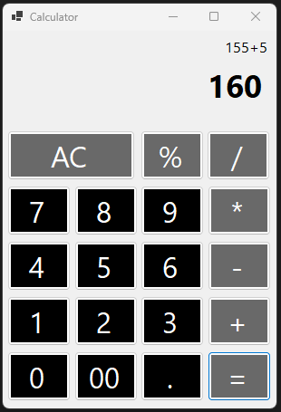

# Desktop Calculator App

A lightweight, user-friendly desktop calculator built with C#. This app supports basic arithmetic operations with a clean and intuitive interface designed for everyday use.

## ✨ Features

- Simple, clean UI
- Supports:
  - Addition, subtraction
  - Multiplication, division
  - Decimal operations
  - Clear functionality
- Responsive layout for better usability
- Lightweight and fast



### Installation

1. Clone the repository:
   ```bash
   git clone https://github.com/yourusername/desktop-calculator.git
